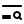
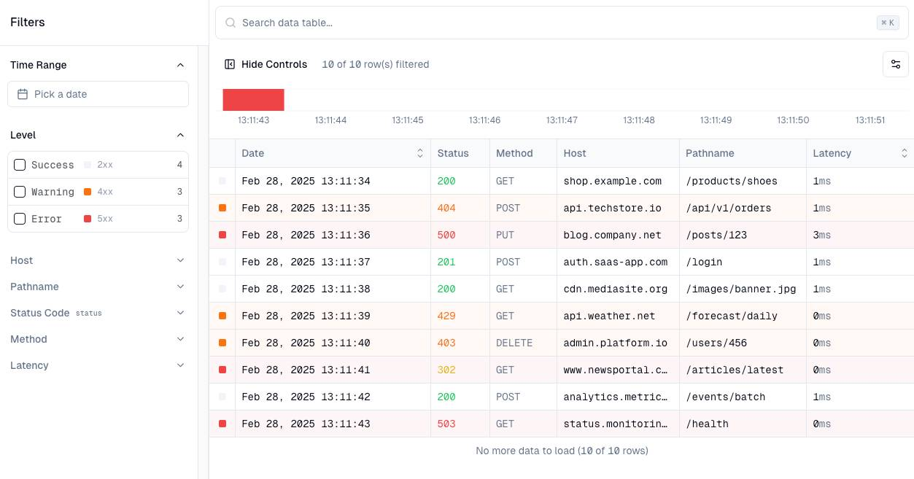
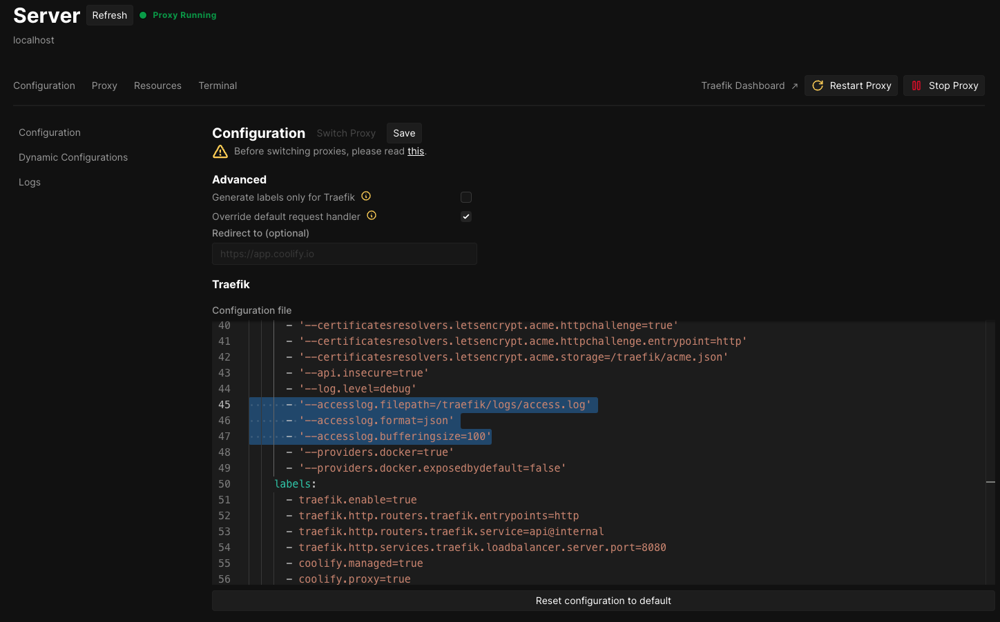

# Access Log UI

<table>
  <tr>
    <td>
      
    </td>
    <td>
      <span>A modern UI for viewing and analyzing access logs with powerful filtering and search capabilities.</span>
    </td>
  </tr>
</table>

<p align="center">
  
</p>

This is a fork of the amazing https://github.com/openstatusHQ/data-table-filters with support for reading an access log file (in JSON format for now).

## Built With

- [nextjs](https://nextjs.org)
- [tanstack-query](https://tanstack.com/query/latest)
- [tanstack-table](https://tanstack.com/table/latest)
- [shadcn/ui](https://ui.shadcn.com)
- [cmdk](http://cmdk.paco.me)
- [nuqs](http://nuqs.47ng.com)
- [dnd-kit](https://dndkit.com)

## Getting Started

You can configure this project using .env file

```
USE_MOCK_DATA=false
LOG_FILE_PATH=./logs/access.log
```

and to run the project in development mode:

```bash
yarn dev
```

Open [http://localhost:3000](http://localhost:3000) with your browser to see the result.

## For Coolify

To use this project with Coolify, you have to follow these steps:

1. Update your traefik proxy configuration to add access logs :

```
      - '--accesslog.filepath=/traefik/logs/access.log'
      - '--accesslog.format=json'
      - '--accesslog.bufferingsize=100'
      - '--accesslog.fields.headers.defaultmode=drop'
      - '--accesslog.fields.headers.names.User-Agent=keep'
```



2. Configure a volume storage to share the access log file with the container :

**Source path** : `/data/coolify/proxy/logs`

**Destination path** : `/app/logs`

## Credits

- [openstatusHQ](https://github.com/openstatusHQ) for the amazing data table filters example
